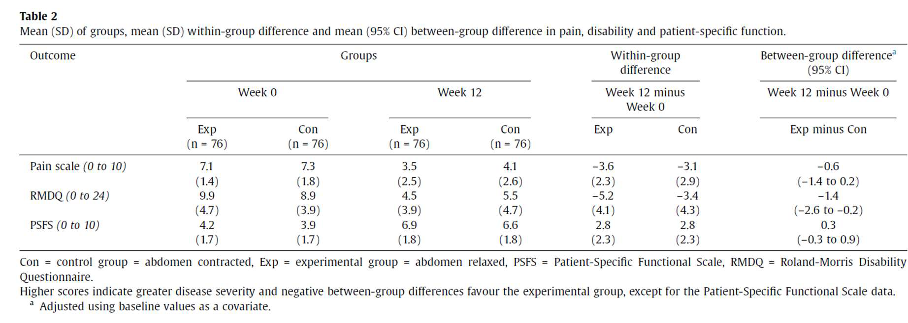

\clearpage
\pagestyle{plain}
\setcounter{page}{1}

```{r setup, include=FALSE}
knitr::opts_chunk$set(warning = FALSE, message = FALSE, tidy = FALSE) 
```

# Ejercicio 1

## Enunciado

En un estudio de demanda asistencial, se analiza el número de visitas a un servicio de urgencias hospitalarias durante un turno Se asume que las visitas pueden originarse por dos tipos de demanda: **tipo A** y **tipo B**.

Se asume que el número de eventos medio del tipo A es $\lambda_A$ y el promedio de eventos del tipo B es el $\lambda_B$. donde $\lambda_B$ es el doble de $\lambda_A$. Se sabe que los mecanismos que generan ambos tipos de demanda son independientes.

En los últimos 25 turnos se han observado el número de eventos totales de la siguiente muestra

$$
x = (9, 12, 14, 10, 15, 8, 13, 11, 17, 12, 7, 16, 13, 10, 11, 14, 9, 18, 12, 13, 6, 15, 11, 12, 14)
$$

1.  Escribir la función de verosimilitud para el promedio de eventos $\lambda_A$, simplifícala y elimina las constantes y dibuja el logaritmo de la verosimilitud entre de 0 y 15.

2.  Obtener el estimador máximo verosímil (EMV) de $\lambda_A$ y $\lambda_B$ y del número total de eventos.

3.  Obtener el estimador por el método de los momentos (EMM) del número total de eventos.

4.  Comparar ambos estimadores e interpretar el resultado.

5.  Determinar si el EMV es insesgado y calcular su varianza: Este apartado lo podéis resolver con simulación utilizando una $N = 20$ y un valor de $\lambda_A = 2$. Interpreta el resultado.

## Resolución

En este primer ejercicio se pide estudiar el número de pacientes que acuden a un servicio de urgencias hospitalarias durante un turno, suponiendo que dichas visitas pueden deberse a dos tipos de demanda diferentes, la de tipo A y la de tipo B.

Para ello, se asume que el número de visitas de cada tipo sigue una distribución de Poisson, con parámetros medios $\lambda_A$ y $\lambda_B$, respectivamente. Además, se especifica que la tasa media de eventos de tipo B es el doble que la correspondiente a los eventos de tipo A, es decir:

$$
\lambda_B = 2\lambda_A
$$

Por su parte, los datos observados en los últimos 25 turnos se representan mediante la muestra:

```{r}
x <- c(9, 12, 14, 10, 15, 8, 13, 11, 17, 12,
       7, 16, 13, 10, 11, 14, 9, 18, 12, 13,
       6, 15, 11, 12, 14)

x
```

Con esta información, se resuelven a continuación los distintos apartados del ejercicio.

### Primer apartado

Como hemos visto anteriormente, el número de visitas de tipo A durante un turno puede modelarse mediante una distribución de Poisson con parámetro $\lambda_A$:

$$
X_A \sim Poisson(\lambda_A)
$$

De forma análoga, las visitas de tipo B siguen una distribución de Poisson con parámetro $\lambda_B$:

$$
X_B \sim Poisson(\lambda_B)
$$

Además, el problema indica que la tasa media de llegadas del tipo B es el doble que la del tipo A. Es decir:

$$
\lambda_B = 2\lambda_A
$$

Por tanto, podemos reescribir la distribución de $X_B$ en función de $\lambda_A$:

$$
X_B \sim Poisson(2\lambda_A)
$$

En la muestra no observamos por separado las visitas de tipo A y B, sino el número total de visitas registradas en cada turno. Por ello, definimos:

$$
X = X_A + X_B
$$

Como ambas variables son independientes, podemos utilizar la propiedad de aditividad de la distribución de Poisson. Es decir, la suma de dos variables Poisson independientes sigue también una distribución de Poisson cuyo parámetro es la suma de sus parámetros. Así, podemos expresar:

$$
X \sim Poisson(\lambda_A + \lambda_B)
$$

Sustituyendo $\lambda_B = 2\lambda_A$, obtenemos:

$$
X \sim Poisson(3\lambda_A)
$$

Por tanto, la función de probabilidad asociada a cada observación $x_i$ es:

$$
P(X=x_i)=
\frac{e^{-3\lambda_A}(3\lambda_A)^{x_i}}{x_i!}
$$

Si consideramos una muestra aleatoria independiente de tamaño $n$, la función de verosimilitud se obtiene multiplicando las probabilidades de todas las observaciones:

$$
L(\lambda_A)
=
\prod_{i=1}^{n}
\frac{e^{-3\lambda_A}(3\lambda_A)^{x_i}}{x_i!}
$$

Agrupando términos:

$$
L(\lambda_A)
=
e^{-3n\lambda_A}
(3\lambda_A)^{\sum_{i=1}^{n}x_i}
\prod_{i=1}^{n}\frac{1}{x_i!}
$$

El término

$$
\prod_{i=1}^{n}\frac{1}{x_i!}
$$

no depende de $\lambda_A$, por lo que puede considerarse constante respecto al parámetro. Además, el factor $3^{\sum_{i=1}^{n} x_i}$ que aparece en el término $(3\lambda_A)^{\sum_{i=1}^{n} x_i}$ tampoco depende de $\lambda_A$, por lo que también puede absorberse dentro de la constante de proporcionalidad. Así, para maximizar la verosimilitud podemos trabajar con la expresión proporcional:

$$
L(\lambda_A)\propto
e^{-3n\lambda_A}
\lambda_A^{\sum_{i=1}^{n}x_i}
$$

Tomando logaritmos y eliminando constantes que no dependen de $\lambda_A$, obtenemos la log-verosimilitud:

$$
\ell(\lambda_A)
=
-3n\lambda_A
+
\left(\sum_{i=1}^{n}x_i\right)\log(\lambda_A)
$$

A continuación, representamos gráficamente esta función para distintos valores de $\lambda_A$:

```{r}
logverosimilitud <- function(lambda_A, x) {
  n <- length(x)
  suma_x <- sum(x)
  -3 * n * lambda_A + suma_x * log(lambda_A)
}

lambda_grid <- seq(0.001, 15, length.out = 1000)
loglik_values <- logverosimilitud(lambda_grid, x)

plot(lambda_grid, loglik_values,
     type = "l",
     xlab = expression(lambda[A]),
     ylab = "Log-verosimilitud",
     main = expression("Log-verosimilitud en función de " * lambda[A]))
```

En el gráfico se puede observar que la log-verosimilitud alcanza un único máximo, lo que indica la existencia de un estimador de máxima verosimilitud bien definido para $\lambda_A$. Además, la forma cóncava de la curva es coherente con el comportamiento habitual de los modelos Poisson.

### Segundo apartado

Para obtener el estimador máximo verosímil de $\lambda_A$, partimos de la log-verosimilitud obtenida anteriormente:

$$
\ell(\lambda_A)
=
-3n\lambda_A
+
\left(\sum_{i=1}^{n}x_i\right)\log(\lambda_A)
$$

Derivamos respecto a $\lambda_A$:

$$
\frac{d\ell(\lambda_A)}{d\lambda_A}
=
-3n
+
\frac{\sum_{i=1}^{n}x_i}{\lambda_A}
$$

Igualamos a cero y despejamos:

$$
-3n
+
\frac{\sum_{i=1}^{n}x_i}{\lambda_A}
=
0
$$

$$
\widehat{\lambda}_A
=
\frac{\sum_{i=1}^{n}x_i}{3n}
$$

Como

$$
\bar{x}
=
\frac{1}{n}\sum_{i=1}^{n}x_i
$$

podemos escribir:

$$
\widehat{\lambda}_A
=
\frac{\bar{x}}{3}
$$

Además, como $\lambda_B = 2\lambda_A$, entonces:

$$
\widehat{\lambda}_B
=
2\widehat{\lambda}_A
$$

Y el número medio total de visitas por turno es:

$$
\lambda_T
=
\lambda_A+\lambda_B
=
3\lambda_A
$$

Por tanto:

$$
\widehat{\lambda}_T
=
3\widehat{\lambda}_A
=
\bar{x}
$$

Calculamos estos valores usando R:

```{r}
n <- length(x)
media_x <- mean(x)

lambda_A_EMV <- media_x / 3
lambda_B_EMV <- 2 * lambda_A_EMV
lambda_total_EMV <- media_x

resultados_EMV <- data.frame(
  Parametro = c("lambda_A", "lambda_B", "lambda_total"),
  Estimador_EMV = c(lambda_A_EMV,
                    lambda_B_EMV,
                    lambda_total_EMV)
)

resultados_EMV
```

Con los datos de la muestra, la media observada es:

$$
\bar{x} = 12.08
$$

Por tanto, las estimaciones son aproximadamente:

$$
\widehat{\lambda}_A = 4.03
$$

$$
\widehat{\lambda}_B = 8.05
$$

$$
\widehat{\lambda}_T = 12.08
$$

Esto significa que, según el modelo, se estiman unas $4.03$ visitas medias de tipo A por turno, unas $8.05$ visitas medias de tipo B y un total medio de $12.08$ visitas por turno.

### Tercer apartado

El método de los momentos consiste en igualar los momentos teóricos de la distribución con los momentos observados en la muestra.

En este caso, la variable observada es el número total de visitas por turno:

$$
X \sim Poisson(3\lambda_A)
$$

Como en una distribución de Poisson la esperanza coincide con el parámetro, tenemos:

$$
E(X)=3\lambda_A
$$

El primer momento muestral es la media muestral:

$$
\bar{X}
$$

Aplicando el método de los momentos:

$$
\bar{X}=3\lambda_A
$$

Despejando:

$$
\widetilde{\lambda}_A
=
\frac{\bar{X}}{3}
$$

Como el número medio total de visitas es:

$$
\lambda_T = 3\lambda_A
$$

el estimador por el método de los momentos para el total es:

$$
\widetilde{\lambda}_T
=
\bar{X}
$$

Este es precisamente el parámetro solicitado en el enunciado, ya que representa el número medio total de eventos observados por turno. Haciendo uso de R, se calcula de la siguiente manera:

```{r}
lambda_A_EMM <- media_x / 3
lambda_B_EMM <- 2 * lambda_A_EMM
lambda_total_EMM <- media_x

resultados_EMM <- data.frame(
  Parametro = c("lambda_A", "lambda_B", "lambda_total"),
  Estimador_EMM = c(lambda_A_EMM,
                    lambda_B_EMM,
                    lambda_total_EMM)
)

resultados_EMM
```

En este caso, el estimador por el método de los momentos da los mismos valores que el estimador máximo verosímil.

### Cuarto apartado

En este ejercicio, el estimador máximo verosímil y el estimador por el método de los momentos coinciden.

Podemos comprobarlo en R comparando ambos resultados:

```{r}
comparacion <- data.frame(
  Metodo = c("Maxima verosimilitud",
             "Metodo de los momentos"),
  lambda_A = c(lambda_A_EMV,
               lambda_A_EMM),
  lambda_B = c(lambda_B_EMV,
               lambda_B_EMM),
  lambda_total = c(lambda_total_EMV,
                   lambda_total_EMM)
)

comparacion
```

La coincidencia se debe a que la variable total observada sigue una distribución de Poisson:

$$
X \sim Poisson(3\lambda_A)
$$

y en una distribución de Poisson la esperanza coincide con el parámetro.

Por un lado, mediante máxima verosimilitud obtenemos:

$$
\widehat{\lambda}_T = \bar{x}
$$

y, por otro lado, mediante el método de los momentos también obtenemos:

$$
\widetilde{\lambda}_T = \bar{x}
$$

Por tanto, ambos métodos estiman el número medio total de visitas por turno mediante la media muestral. La coincidencia entre ambos estimadores no siempre ocurre en todos los modelos estadísticos, pero en el caso de la distribución de Poisson sucede porque el parámetro de la distribución coincide con su esperanza matemática. Por ello, tanto el método de máxima verosimilitud como el método de los momentos conducen naturalmente a la media muestral como estimador.

Desde un punto de vista aplicado, esto quiere decir que el número medio total de visitas por turno se estima directamente como $12.08$. Además, como el modelo supone que la demanda de tipo B es el doble que la de tipo A, aproximadamente un tercio de las visitas esperadas corresponden al tipo A y dos tercios al tipo B.

### Quinto apartado

El estimador máximo verosímil de $\lambda_A$ es:

$$
\widehat{\lambda}_A
=
\frac{\bar{X}}{3}
$$

Para estudiar si es insesgado, calculamos su esperanza.

Sabemos que:

$$
X_i \sim Poisson(3\lambda_A)
$$

Por tanto:

$$
E(X_i)=3\lambda_A
$$

y entonces:

$$
E(\bar{X})=3\lambda_A
$$

Así:

$$
E(\widehat{\lambda}_A)
=
E\left(\frac{\bar{X}}{3}\right)
=
\frac{1}{3}E(\bar{X})
$$

$$
E(\widehat{\lambda}_A)
=
\frac{1}{3}(3\lambda_A)
=
\lambda_A
$$

Por tanto, el EMV de $\lambda_A$ es insesgado, ya que su esperanza coincide exactamente con el valor verdadero del parámetro. Esto implica que, en promedio, el estimador no tiende ni a sobrestimar ni a infraestimar el valor real de $\lambda_A$, por lo que constituye un estimador adecuado desde el punto de vista estadístico.

Ahora calculamos su varianza:

$$
Var(\widehat{\lambda}_A)
=
Var\left(\frac{\bar{X}}{3}\right)
$$

Aplicando la propiedad de la varianza respecto a constantes:

$$
Var(\widehat{\lambda}_A)
=
\frac{1}{9}Var(\bar{X})
$$

Como cada observación sigue una distribución de Poisson con parámetro $3\lambda_A$, sabemos que en una distribución Poisson la varianza coincide con la esperanza. Por tanto:

$$
Var(X_i)=3\lambda_A
$$

Además, la varianza de la media muestral de una muestra aleatoria independiente de tamaño $n$ es:

$$
Var(\bar{X})
=
\frac{Var(X_i)}{n}
=
\frac{3\lambda_A}{n}
$$

Sustituyendo este resultado en la expresión anterior:

$$
Var(\widehat{\lambda}_A)
=
\frac{1}{9}
\frac{3\lambda_A}{n}
$$

Simplificando:

$$
Var(\widehat{\lambda}_A)
=
\frac{\lambda_A}{3n}
$$

Este resultado muestra que la variabilidad del estimador disminuye a medida que aumenta el tamaño muestral. Por tanto, cuanto mayor sea el número de turnos observados, más estable y precisa será la estimación de $\lambda_A$.

El enunciado propone comprobar este resultado mediante simulación usando $N=20$ y $\lambda_A=2$. En ese caso:

$$
Var(\widehat{\lambda}_A)
=
\frac{2}{3 \cdot 20}
=
0.0333
$$

Esta será la varianza teórica esperada del estimador bajo las condiciones especificadas. A continuación, realizamos una simulación en R para verificar empíricamente tanto la insesgadez del EMV como la aproximación de su varianza al valor teórico calculado.

Realizamos la simulación en R:

```{r}
set.seed(123)

N <- 20
lambda_A_real <- 2
lambda_total_real <- 3 * lambda_A_real

B <- 10000

lambda_A_sim <- replicate(B, {

  # Simulamos N turnos, donde el total sigue una Poisson(3*lambda_A)
  muestra <- rpois(N, lambda_total_real)

  # Calculamos el EMV de lambda_A en esa muestra
  mean(muestra) / 3

})

media_simulada <- mean(lambda_A_sim)
sesgo_simulado <- media_simulada - lambda_A_real
varianza_simulada <- var(lambda_A_sim)
varianza_teorica <- lambda_A_real / (3 * N)

resultados_simulacion <- data.frame(
  Media_simulada = media_simulada,
  Sesgo_simulado = sesgo_simulado,
  Varianza_simulada = varianza_simulada,
  Varianza_teorica = varianza_teorica
)

resultados_simulacion
```

También podemos representar gráficamente la distribución simulada del estimador:

```{r}
hist(lambda_A_sim,
     breaks = 40,
     main = expression("Distribucion simulada de " * hat(lambda)[A]),
     xlab = expression(hat(lambda)[A]))

abline(v = lambda_A_real,
       col = "red",
       lwd = 2)
```

En la simulación, la media de los valores obtenidos para $\widehat{\lambda}_A$ debería quedar muy cerca de $2$, que es el valor real usado para generar los datos. Por tanto, el sesgo simulado debería ser cercano a cero.

Además, la varianza simulada debería aproximarse a la varianza teórica:

$$
Var(\widehat{\lambda}_A)=0.0333
$$

Las pequeñas diferencias entre la varianza simulada y la teórica se deben al error de simulación, ya que estamos usando un número finito de repeticiones. Además, el histograma obtenido muestra una distribución aproximadamente centrada en el valor real \(\lambda_A = 2\), lo que refuerza visualmente la propiedad de insesgadez del estimador. También se observa que la dispersión de las estimaciones es relativamente pequeña, coherente con la varianza teórica calculada.

En conclusión, el estimador máximo verosímil de $\lambda_A$ resulta ser insesgado, ya que su esperanza coincide con el valor real del parámetro. Además, su varianza disminuye a medida que aumenta el tamaño muestral, lo que implica que las estimaciones obtenidas son cada vez más precisas y estables. Por tanto, si se dispone de un mayor número de turnos observados, el estimador tenderá a concentrarse alrededor del verdadero valor de $\lambda_A$, reduciendo la variabilidad asociada a la estimación.


# Ejercicio 2

## Enunciado

En un estudio sobre el mantenimiento del abdomen relajado (Exposición) o abdomen contraído (Control) durante un ejercicio de Pilates se evaluó la intensidad del dolor
(*pain scale*), la funcionalidad del paciente y la discapacidad de personas (RMDQ) con dolor bajo de espalda. Los resultados se observan en la Tabla 2 para tres escalas en la semana 0 y en la semana 12.

```{r tabla2, echo=FALSE, out.width='100%', fig.align='center', fig.cap=NULL}

```

1. Utilizando la información resumida proporcionada en la Tabla 2, construye los intervalos de confianza al 95% para el cambio medio observado entre la semana 0 y la semana 12 en la escala de intensidad del dolor (*pain scale*) para cada grupo de intervención (intra-grupo). Interpreta los resultados.

2. Considerando las estimaciones puntuales y los intervalos de confianza correspondientes a la diferencia entre grupos al cabo de 12 semanas que se presentan en la última columna de la Tabla 2 para las tres variables de resultado. Analiza comparativamente e interpreta estos resultados atendiendo a la dirección y la magnitud del efecto y a la precisión de la estimación. En el pie de tabla dispones de información detallada sobre las escalas.

3. La diferencia entre grupos mostrada en la última columna de la Tabla 2 ha sido estimada incorporando los valores basales como covariable en el modelo de análisis. Partiendo únicamente de los estadísticos proporcionados en la tabla, estima el intervalo de confianza al 95% para la diferencia no ajustada en el cambio de la escala RMDQ entre grupos. Explica las diferencias de resultados entre tu estimación y la que proporciona la tabla del artículo desde un punto de vista metodológico.

4. Identifica los principales supuestos estadísticos necesarios para la validez de los intervalos de confianza estimados en este ensayo, tanto a nivel intra-grupo como inter-grupo, y las limitaciones que pueden derivarse de la Tabla 2.

5. Supóngase que el ensayo se hubiese diseñado con el objetivo principal de estimar la reducción media en la escala de discapacidad (RMDQ) en el grupo experimental con un intervalo de confianza bilateral al 95% cuya amplitud total no exceda de 4 puntos.

    a) Determina el tamaño muestral necesario por grupo para alcanzar dicha precisión, justificando claramente las asunciones realizadas.

    b) Repite el cálculo para la variable de intensidad del dolor (*Pain Scale*) con la misma premisa que no debe exceder 4 puntos.

    c) A la vista de los resultados obtenidos, evalúa críticamente las implicaciones de realizar el cálculo del tamaño muestral basándose en una única variable de resultado cuando el estudio contempla múltiples desenlaces de interés clínico.

## Resolución

En este segundo ejercicio se trabaja con un ensayo en el que se comparan dos formas de realizar un ejercicio de Pilates en personas con dolor lumbar. Por un lado, se considera el grupo experimental o de exposición, en el que se mantiene el abdomen relajado. Por otro lado, se considera el grupo control, en el que se mantiene el abdomen contraído. El objetivo es estudiar la evolución de tres variables clínicas entre la semana 0 y la semana 12, así como comparar los resultados entre ambos grupos al final del seguimiento. Las variables consideradas son la intensidad del dolor, la funcionalidad y la discapacidad medida mediante la escala RMDQ.

En primer lugar, introducimos en R los valores necesarios procedentes de la Tabla 2:

```{r}
# Datos procedentes de la Tabla 2

# Tamaños muestrales
n_exp <- 76
n_ctrl <- 76

# Pain scale
pain_exp_0_mean <- 7.1
pain_exp_0_sd <- 1.4
pain_exp_12_mean <- 3.5
pain_exp_12_sd <- 2.5

pain_ctrl_0_mean <- 7.3
pain_ctrl_0_sd <- 1.8
pain_ctrl_12_mean <- 4.1
pain_ctrl_12_sd <- 2.6

pain_exp_change_mean <- -3.6
pain_ctrl_change_mean <- -3.1

pain_exp_change_sd <- 2.3
pain_ctrl_change_sd <- 2.9

# RMDQ
rmdq_exp_0_mean <- 9.9
rmdq_exp_0_sd <- 4.7
rmdq_exp_12_mean <- 4.5
rmdq_exp_12_sd <- 3.9

rmdq_ctrl_0_mean <- 8.9
rmdq_ctrl_0_sd <- 3.9
rmdq_ctrl_12_mean <- 5.5
rmdq_ctrl_12_sd <- 4.7

rmdq_exp_change_mean <- -5.2
rmdq_ctrl_change_mean <- -3.4

rmdq_exp_change_sd <- 4.1
rmdq_ctrl_change_sd <- 4.3

# PSFS
psfs_exp_0_mean <- 4.2
psfs_exp_0_sd <- 1.7
psfs_exp_12_mean <- 6.9
psfs_exp_12_sd <- 1.8

psfs_ctrl_0_mean <- 3.9
psfs_ctrl_0_sd <- 1.7
psfs_ctrl_12_mean <- 6.6
psfs_ctrl_12_sd <- 1.8

psfs_exp_change_mean <- 2.8
psfs_ctrl_change_mean <- 2.8

psfs_exp_change_sd <- 2.3
psfs_ctrl_change_sd <- 2.3

# Diferencias ajustadas entre grupos
dif_ajustada_pain_est <- -0.6
dif_ajustada_pain_li <- -1.4
dif_ajustada_pain_ls <- 0.2

dif_ajustada_func_est <- 0.3
dif_ajustada_func_li <- -0.3
dif_ajustada_func_ls <- 0.9

dif_ajustada_rmdq_est <- -1.4
dif_ajustada_rmdq_li <- -2.6
dif_ajustada_rmdq_ls <- -0.2
```

### Primer apartado

En este apartado se pide construir los intervalos de confianza al 95% para el cambio medio observado entre la semana 0 y la semana 12 en la escala de intensidad del dolor, dentro de cada grupo.

Denotamos por \(Y_{i0}\) la puntuación de dolor del individuo \(i\) en la semana 0 y por \(Y_{i12}\) la puntuación de dolor del mismo individuo en la semana 12. El cambio individual se define como:

$$
D_i = Y_{i12} - Y_{i0}
$$

De este modo, si la puntuación de dolor disminuye entre la semana 0 y la semana 12, el cambio será negativo. Por tanto, valores negativos de \(D_i\) indican una reducción del dolor y, en consecuencia, una mejoría clínica.

El cambio medio muestral se calcula como:

$$
\bar{D}
=
\frac{1}{n}\sum_{i=1}^{n}D_i
$$

Si \(s_D\) representa la desviación típica de los cambios individuales, el intervalo de confianza bilateral al 95% para el cambio medio intra-grupo viene dado por:

$$
IC_{95\%}(\mu_D)
=
\bar{D}
\pm
t_{n-1,0.975}
\frac{s_D}{\sqrt{n}}
$$

donde \(t_{n-1,0.975}\) es el cuantil 0.975 de la distribución \(t\) de Student con \(n-1\) grados de libertad.

En este caso, la Tabla 2 proporciona directamente la media y la desviación típica del cambio dentro de cada grupo. Por tanto, no es necesario reconstruir la desviación típica del cambio a partir de las desviaciones típicas basal y final.

A continuación, se calcula el intervalo de confianza para cada grupo usando R.

```{r}
# Función para calcular un IC al 95% para un cambio medio intra-grupo
ic_cambio <- function(media_cambio, sd_cambio, n, conf = 0.95) {
  alpha <- 1 - conf
  t_critico <- qt(1 - alpha / 2, df = n - 1)
  error_estandar <- sd_cambio / sqrt(n)

  li <- media_cambio - t_critico * error_estandar
  ls <- media_cambio + t_critico * error_estandar

  data.frame(
    media_cambio = media_cambio,
    sd_cambio = sd_cambio,
    n = n,
    error_estandar = error_estandar,
    limite_inferior = li,
    limite_superior = ls
  )
}

ic_pain_exp <- ic_cambio(
  media_cambio = pain_exp_change_mean,
  sd_cambio = pain_exp_change_sd,
  n = n_exp
)

ic_pain_ctrl <- ic_cambio(
  media_cambio = pain_ctrl_change_mean,
  sd_cambio = pain_ctrl_change_sd,
  n = n_ctrl
)

ic_pain_intragrupo <- rbind(
  cbind(grupo = "Experimental", ic_pain_exp),
  cbind(grupo = "Control", ic_pain_ctrl)
)

ic_pain_intragrupo
```

En el grupo experimental, el cambio medio estimado fue de -3.6 puntos, con un IC95% aproximadamente entre -4.13 y -3.07. En el grupo control, el cambio medio estimado fue de -3.1 puntos, con un IC95% aproximadamente entre -3.76 y -2.44. En ambos casos, los intervalos quedan completamente por debajo de 0, lo que indica una reducción media del dolor a las 12 semanas. Por tanto, ambos grupos muestran una mejoría clínica en la escala de dolor. La interpretación debe hacerse atendiendo tanto al signo como a la amplitud del intervalo. Si el cambio se ha definido como semana 12 menos semana 0, un intervalo situado por debajo de 0 indica que, en promedio, el dolor se ha reducido en ese grupo. Si el intervalo contiene el valor 0, no se puede descartar que el cambio medio real sea nulo al nivel de confianza del 95%.

Además, la amplitud del intervalo proporciona información sobre la precisión de la estimación. Intervalos más estrechos indican mayor precisión, mientras que intervalos más amplios indican mayor incertidumbre, habitualmente asociada a tamaños muestrales pequeños o a una elevada variabilidad de las puntuaciones de dolor. No obstante, estos intervalos intra-grupo describen únicamente la evolución media dentro de cada grupo y no permiten, por sí solos, establecer conclusiones sobre la eficacia comparativa entre intervenciones. Para ello, es necesario analizar directamente la diferencia entre grupos.

### Segundo apartado

En este apartado se analizan las diferencias entre grupos al cabo de 12 semanas que aparecen en la última columna de la Tabla 2. Estas diferencias comparan el resultado medio del grupo experimental con el resultado medio del grupo control, incorporando el valor basal como covariable en el modelo de análisis.

De forma general, una diferencia entre grupos puede escribirse como:

$$
\Delta
=
\mu_E - \mu_C
$$

donde \(\mu_E\) representa la media del grupo experimental y \(\mu_C\) la media del grupo control.

El signo de \(\Delta\) debe interpretarse de acuerdo con la dirección de cada escala. En variables como dolor y RMDQ, puntuaciones más bajas suelen indicar mejor estado clínico. Por tanto, una diferencia negativa, si está definida como experimental menos control, indicaría que el grupo experimental presenta menor dolor o menor discapacidad que el grupo control al final del seguimiento.

Recogemos las estimaciones ajustadas en una tabla resumen:

```{r}
diferencias_ajustadas <- data.frame(
  Variable = c("Pain scale", "Funcionalidad", "RMDQ"),
  Estimacion = c(dif_ajustada_pain_est,
                 dif_ajustada_func_est,
                 dif_ajustada_rmdq_est),
  LI_95 = c(dif_ajustada_pain_li,
            dif_ajustada_func_li,
            dif_ajustada_rmdq_li),
  LS_95 = c(dif_ajustada_pain_ls,
            dif_ajustada_func_ls,
            dif_ajustada_rmdq_ls)
)

diferencias_ajustadas
```

En la escala de dolor, la diferencia ajustada fue de \(-0.6\) puntos, con un IC95% de \((-1.4,\ 0.2)\). Aunque la estimación puntual favorece al grupo experimental, el intervalo incluye el valor 0, por lo que no puede descartarse ausencia de diferencia entre grupos. Por su parte, en la escala RMDQ, la diferencia ajustada fue de \(-1.4\) puntos, con un IC95% de \((-2.6,\ -0.2)\). En este caso, el intervalo no incluye el valor 0, por lo que los resultados sugieren una menor discapacidad en el grupo experimental respecto al grupo control. Finalmente, en la escala PSFS, la diferencia ajustada fue de \(0.3\) puntos, con un IC95% de \((-0.3,\ 0.9)\). Como en esta escala valores más altos indican mejor funcionalidad, la estimación puntual favorece ligeramente al grupo experimental, aunque el intervalo incluye el valor 0 y, por tanto, la evidencia estadística de una diferencia entre grupos es limitada.

Para interpretar estos resultados, debe considerarse la dirección del efecto según la escala de medida. En dolor y RMDQ, puntuaciones más bajas indican menor severidad o discapacidad y, por tanto, una diferencia negativa entre el grupo experimental y el grupo control favorece al grupo experimental. En la escala PSFS ocurre lo contrario, ya que puntuaciones más altas indican mejor funcionalidad y una diferencia positiva favorece al grupo experimental. Además, debe valorarse la magnitud clínica de la diferencia observada, porque una diferencia puede ser estadísticamente compatible con un efecto distinto de cero y aun así ser clínicamente pequeña, por lo que no basta con comprobar si el intervalo de confianza incluye o no el cero. También debe analizarse la precisión de la estimación. Un intervalo de confianza estrecho refleja mayor precisión, mientras que un intervalo amplio indica mayor incertidumbre y puede dificultar la interpretación clínica, especialmente si incluye tanto diferencias clínicamente relevantes como diferencias próximas a cero.

Podemos representar gráficamente las diferencias ajustadas y sus intervalos de confianza:

```{r}
# Gráfico de intervalos de confianza para las diferencias ajustadas
# Ajustamos márgenes para que no se corten las etiquetas
par(mar = c(5, 6, 4, 2))

# Posiciones del eje Y
y_pos <- seq_len(nrow(diferencias_ajustadas))

# Gráfico base
plot(
  x = diferencias_ajustadas$Estimacion,
  y = y_pos,
  xlim = c(-3, 1),
  ylim = c(0.5, 3.5),
  yaxt = "n",
  ylab = "",
  xlab = "Diferencia ajustada entre grupos (Exp - Control)",
  pch = 19,
  cex = 1.3,
  main = "Diferencias ajustadas e IC95% a las 12 semanas"
)

# Etiquetas del eje Y
axis(
  side = 2,
  at = y_pos,
  labels = diferencias_ajustadas$Variable,
  las = 1,
  cex.axis = 1.1
)

# Intervalos de confianza
arrows(
  x0 = diferencias_ajustadas$LI_95,
  y0 = y_pos,
  x1 = diferencias_ajustadas$LS_95,
  y1 = y_pos,
  angle = 90,
  code = 3,
  length = 0.08,
  lwd = 2
)

# Línea vertical en 0
abline(v = 0,
       lty = 2,
       col = "red",
       lwd = 2)

# Cuadrícula suave opcional
grid(nx = NULL, ny = NULL, lty = 3, col = "gray90")
```

La figura muestra las diferencias ajustadas entre el grupo experimental y el grupo control a las 12 semanas, junto con sus intervalos de confianza al 95%.La línea vertical situada en 0 representa la ausencia de diferencia entre grupos. Cuando el intervalo de confianza cruza el valor 0, los datos son compatibles tanto con una diferencia real entre grupos como con ausencia de efecto, por lo que no existe evidencia estadísticamente significativa al nivel del 5%. En la escala RMDQ, el intervalo de confianza queda completamente por debajo de 0, lo que indica una menor discapacidad en el grupo experimental respecto al grupo control. En cambio, para la escala de dolor y la funcionalidad (PSFS), los intervalos incluyen el valor 0, por lo que la evidencia de diferencias entre grupos es limitada. Además de la significación estadística, debe considerarse la amplitud de los intervalos, ya que intervalos más estrechos indican mayor precisión en la estimación del efecto.

### Tercer apartado

En este apartado se pide estimar el intervalo de confianza al 95% para la diferencia no ajustada en el cambio de la escala RMDQ entre grupos. A diferencia del resultado que aparece en la Tabla 2, aquí no se incorporan los valores basales como covariable.

Definimos el cambio medio en cada grupo como:

$$
\bar{D}_E
=
\bar{Y}_{E,12}
-
\bar{Y}_{E,0}
$$

$$
\bar{D}_C
=
\bar{Y}_{C,12}
-
\bar{Y}_{C,0}
$$

La diferencia no ajustada en el cambio entre grupos se calcula como:

$$
\widehat{\Delta}_{no\ ajustada}
=
\bar{D}_E - \bar{D}_C
$$

Es decir:

$$
\widehat{\Delta}_{no\ ajustada}
=
(\bar{Y}_{E,12}-\bar{Y}_{E,0})
-
(\bar{Y}_{C,12}-\bar{Y}_{C,0})
$$

Para construir su intervalo de confianza necesitamos estimar el error estándar de esta diferencia. Si \(s_{D,E}\) y \(s_{D,C}\) son las desviaciones típicas de los cambios en los grupos experimental y control, respectivamente, entonces:

$$
SE(\widehat{\Delta}_{no\ ajustada})
=
\sqrt{
\frac{s_{D,E}^2}{n_E}
+
\frac{s_{D,C}^2}{n_C}
}
$$

El intervalo de confianza aproximado al 95% es:

$$
IC_{95\%}
=
\widehat{\Delta}_{no\ ajustada}
\pm
t_{\nu,0.975}
SE(\widehat{\Delta}_{no\ ajustada})
$$

donde los grados de libertad pueden aproximarse mediante la fórmula de Welch:

$$
\nu
=
\frac{
\left(\frac{s_{D,E}^2}{n_E}+\frac{s_{D,C}^2}{n_C}\right)^2
}{
\frac{\left(\frac{s_{D,E}^2}{n_E}\right)^2}{n_E-1}
+
\frac{\left(\frac{s_{D,C}^2}{n_C}\right)^2}{n_C-1}
}
$$

Calculamos este intervalo con R. De nuevo, si la Tabla 2 proporciona directamente la desviación típica del cambio en RMDQ, debe introducirse. Si no la proporciona, se aproxima usando una correlación basal-final.

```{r}
# Cambios medios en RMDQ
rmdq_exp_change_mean <- -5.2
rmdq_ctrl_change_mean <- -3.4

# Diferencia no ajustada en el cambio
dif_no_ajustada_rmdq <- rmdq_exp_change_mean - rmdq_ctrl_change_mean

# Error estándar
se_dif_no_ajustada_rmdq <- sqrt(
  rmdq_exp_change_sd^2 / n_exp +
    rmdq_ctrl_change_sd^2 / n_ctrl
)

# Grados de libertad de Welch
gl_welch <- (
  (rmdq_exp_change_sd^2 / n_exp +
     rmdq_ctrl_change_sd^2 / n_ctrl)^2
) /
  (
    (rmdq_exp_change_sd^2 / n_exp)^2 / (n_exp - 1) +
      (rmdq_ctrl_change_sd^2 / n_ctrl)^2 / (n_ctrl - 1)
  )

t_critico <- qt(0.975, df = gl_welch)

li_rmdq_no_ajustada <- dif_no_ajustada_rmdq -
  t_critico * se_dif_no_ajustada_rmdq

ls_rmdq_no_ajustada <- dif_no_ajustada_rmdq +
  t_critico * se_dif_no_ajustada_rmdq

ic_rmdq_no_ajustada <- data.frame(
  diferencia_no_ajustada = dif_no_ajustada_rmdq,
  error_estandar = se_dif_no_ajustada_rmdq,
  grados_libertad = gl_welch,
  LI_95 = li_rmdq_no_ajustada,
  LS_95 = ls_rmdq_no_ajustada
)

ic_rmdq_no_ajustada
```

La diferencia entre este resultado y el que aparece en la Tabla 2 se explica por el método de análisis empleado. La estimación anterior es una comparación no ajustada de cambios medios. En cambio, la estimación de la tabla se obtiene mediante un modelo ajustado por el valor basal.

Desde el punto de vista metodológico, ajustar por el valor basal suele ser preferible en un ensayo clínico porque permite comparar los grupos a las 12 semanas controlando posibles diferencias iniciales. Incluso cuando la asignación es aleatoria, pueden existir desequilibrios basales por azar. El ajuste por el valor basal puede mejorar la precisión de la estimación y reducir la varianza residual del modelo.

Por tanto, no debe sorprender que el intervalo de confianza no ajustado difiera del intervalo presentado en la tabla. El análisis no ajustado se basa únicamente en los cambios medios, mientras que el análisis ajustado utiliza información adicional sobre el punto de partida de cada grupo. En general, el análisis ajustado por el valor basal suele ser más eficiente y metodológicamente más adecuado para comparar resultados finales en presencia de mediciones basales.

### Cuarto apartado

Los intervalos de confianza estimados en este ejercicio descansan sobre varios supuestos estadísticos.

En primer lugar, para los intervalos intra-grupo se asume que los cambios individuales dentro de cada grupo constituyen una muestra aleatoria de la población de interés. También se asume que las observaciones son independientes entre sí, es decir, que la evolución de un paciente no condiciona la evolución de otro paciente.

En segundo lugar, se asume que la distribución de los cambios es aproximadamente normal dentro de cada grupo o, alternativamente, que el tamaño muestral es suficientemente grande para justificar una aproximación normal mediante el teorema central del límite. En muestras pequeñas, una marcada asimetría o la presencia de valores extremos puede afectar de forma importante a la validez de los intervalos basados en la distribución \(t\).

En tercer lugar, para las comparaciones inter-grupo no ajustadas se asume independencia entre los grupos. Además, si se usan fórmulas con varianzas separadas, como la aproximación de Welch, no es necesario asumir igualdad estricta de varianzas. En cambio, si se usara un intervalo con varianza combinada, sí sería necesario asumir homogeneidad de varianzas entre grupos.

En cuarto lugar, en el análisis ajustado por valores basales se asume que el modelo especificado es adecuado. Esto implica que la relación entre el valor basal y el resultado a las 12 semanas es aproximadamente lineal y comparable entre grupos, salvo que se incluya explícitamente una interacción. También se asume que los residuos del modelo tienen una distribución razonablemente normal, varianza constante e independencia.

Una limitación importante de la Tabla 2 es que solo proporciona información resumida. Al no disponer de los datos individuales, no se puede comprobar directamente la distribución de los cambios, la presencia de valores atípicos, la correlación entre la medición basal y la final, ni el patrón de pérdidas de seguimiento. Además, si no se proporciona la desviación típica del cambio, es necesario asumir una correlación basal-final para aproximarla, lo que introduce incertidumbre adicional.

Otra limitación es que los intervalos intra-grupo no responden exactamente a la misma pregunta que los intervalos inter-grupo. Un cambio significativo dentro de un grupo no implica necesariamente que exista una diferencia significativa entre grupos. Para evaluar la eficacia comparativa de la intervención, la comparación principal debe ser la diferencia entre grupos, preferiblemente ajustada por el valor basal.

### Quinto apartado

El enunciado indica que el objetivo principal es estimar la reducción media en el grupo experimental. Por ello, el cálculo principal se plantea como la estimación de una media intra-grupo. No obstante, dado que el contexto procede de un ensayo con dos grupos, también puede considerarse una interpretación alternativa basada en la comparación entre grupos. En ese caso, el tamaño muestral requerido por grupo sería mayor, al intervenir la variabilidad de dos grupos independientes.

Si la amplitud total del intervalo no debe exceder de 4 puntos, entonces el margen de error máximo permitido es:

$$
E = \frac{4}{2} = 2
$$

Para estimar una media con un intervalo de confianza bilateral al 95%, el tamaño muestral aproximado viene dado por:

$$
n
=
\left(
\frac{z_{0.975}s}{E}
\right)^2
$$

donde \(s\) es una estimación de la desviación típica de la variable de interés y \(z_{0.975}=1.96\). Como el tamaño muestral debe ser un número entero y se desea garantizar la precisión, se redondea hacia arriba:

$$
n
=
\left\lceil
\left(
\frac{1.96s}{2}
\right)^2
\right\rceil
$$
Si se interpretase el objetivo como una comparación de cambios entre dos grupos independientes, una aproximación habitual sería:

$$
n
=
\left\lceil
\frac{2z_{0.975}^2s^2}{E^2}
\right\rceil
$$

donde \(n\) representa el tamaño muestral necesario en cada grupo, asumiendo tamaños iguales y una desviación típica común.

**Apartado 5a**

Para la escala RMDQ en el grupo experimental, usamos como estimación de la desviación típica la desviación típica observada en la Tabla 2. Una opción razonable es usar la desviación típica basal si el objetivo es planificar el estudio antes de conocer el resultado final, o la desviación típica del cambio si el objetivo se define explícitamente sobre la reducción media.

En este ejercicio, como se habla de estimar la reducción media en RMDQ, la opción más coherente es utilizar la desviación típica del cambio. Si no se dispone de ella en la tabla, se aproxima mediante la misma expresión utilizada anteriormente:

$$
s_D
=
\sqrt{
s_0^2+s_{12}^2-2\rho s_0s_{12}
}
$$

Calculamos el tamaño muestral necesario en R:

```{r}
# Desviación típica asumida para el cambio en RMDQ del grupo experimental
amplitud_total <- 4
E <- amplitud_total / 2
z <- qnorm(0.975)

sd_rmdq_diseno <- rmdq_exp_change_sd

n_rmdq <- ceiling((z * sd_rmdq_diseno / E)^2)
n_rmdq_comparacion <- ceiling(2 * (z * sd_rmdq_diseno / E)^2)

data.frame(
  Variable = "RMDQ",
  SD_asumida = sd_rmdq_diseno,
  Margen_error = E,
  n_media_intragrupo = n_rmdq,
  n_comparacion_por_grupo = n_rmdq_comparacion
)
```

A la vista de los resultados, el tamaño muestral obtenido para la escala RMDQ es de aproximadamente 17 pacientes si el objetivo es estimar la reducción media dentro del grupo experimental con la precisión especificada. Esto significa que, con una muestra de ese tamaño, el intervalo de confianza bilateral al 95% tendría una amplitud aproximada de 4 puntos, es decir, un margen de error de ±2 puntos alrededor de la media estimada. Cuando el objetivo pasa a ser comparar dos grupos independientes, el tamaño necesario aumenta hasta aproximadamente 33 pacientes por grupo. Este incremento se debe a que la comparación entre grupos incorpora la variabilidad de ambos grupos simultáneamente, lo que aumenta la incertidumbre de la estimación y exige muestras mayores para mantener la misma precisión. Los resultados muestran que la escala RMDQ presenta una variabilidad relativamente elevada, por lo que se necesitan más participantes para estimar el efecto con precisión suficiente.

**Apartado 5b**

Repetimos el mismo cálculo para la variable de intensidad del dolor. El criterio de precisión vuelve a ser el mismo: una amplitud total máxima de 4 puntos, por lo que el margen de error es \(E=2\).

```{r}
# Desviación típica asumida para el cambio en Pain Scale del grupo experimental
sd_pain_diseno <- pain_exp_change_sd

n_pain <- ceiling((z * sd_pain_diseno / E)^2)
n_pain_comparacion <- ceiling(2 * (z * sd_pain_diseno / E)^2)

data.frame(
  Variable = "Pain Scale",
  SD_asumida = sd_pain_diseno,
  Margen_error = E,
  n_media_intragrupo = n_pain,
  n_comparacion_por_grupo = n_pain_comparacion
)
```

A la vista de los resultados, es posible establecer que en la escala de intensidad del dolor el tamaño muestral necesario es considerablemente menor. Concretamente, aproximadamente 6 pacientes para la estimación intra-grupo y 11 pacientes por grupo para la comparación entre grupos. Esta diferencia respecto a RMDQ se explica porque la variabilidad observada en la escala de dolor es menor. Al existir menos dispersión en los cambios observados, la estimación de la media resulta más precisa y, por tanto, puede alcanzarse el mismo nivel de precisión con un número menor de participantes.

**Apartado 5c**

Basar el cálculo del tamaño muestral en una única variable de resultado puede ser problemático cuando el estudio contempla múltiples desenlaces clínicamente relevantes. Cada variable puede tener una escala distinta, una variabilidad diferente y una mínima diferencia clínicamente importante propia. Por tanto, un tamaño muestral suficiente para estimar con precisión una variable puede ser insuficiente para otra.

En este ensayo, por ejemplo, dolor, funcionalidad y discapacidad no tienen necesariamente la misma dispersión ni la misma relevancia clínica por unidad de medida. Diseñar el estudio solo según dolor podría ser insuficiente para RMDQ. Del mismo modo, diseñarlo solo con la escala de dolor podría no garantizar una estimación suficientemente precisa de la discapacidad.

Por ello, cuando existen varios desenlaces importantes, es recomendable identificar previamente cuál es la variable principal del estudio. El tamaño muestral debería justificarse en función de esa variable principal, pero también conviene realizar análisis de sensibilidad para los desenlaces secundarios más relevantes. Si varios resultados son igualmente importantes para la interpretación clínica, puede ser prudente elegir el mayor tamaño muestral requerido entre ellos.

En conclusión, el cálculo del tamaño muestral no debe plantearse como una operación puramente mecánica. Debe apoyarse en criterios estadísticos, pero también en criterios clínicos. La precisión deseada, la variabilidad esperada, la escala de medida y la importancia clínica de cada desenlace deben considerarse conjuntamente antes de decidir el tamaño definitivo del ensayo.